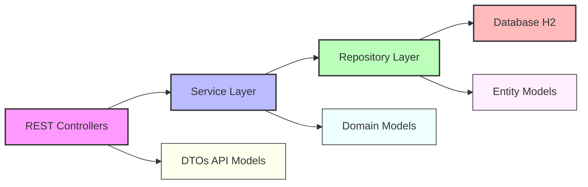
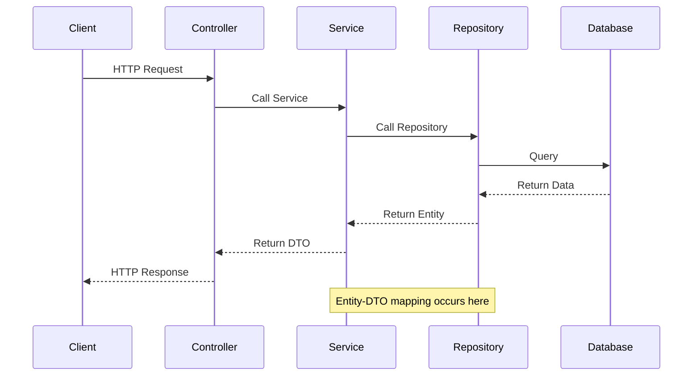

# API Application Design Suggestion

## Introduction

This document outlines the design of the API component for the TODO List application. The API serves as a Backend-For-Frontend (BFF) for the React SPA, providing RESTful endpoints to manage TODO items. The design follows modern best practices for Java Spring Boot applications, emphasizing clean architecture, separation of concerns, and maintainability.

## Justification

The proposed API design is justified by the following factors:

1. **Spring Boot Framework**: Spring Boot provides a robust, mature ecosystem for building REST APIs with extensive support for security, data access, and testing.
2. **REST Architecture**: REST principles ensure a clear, standard approach to API design that is widely understood and compatible with web clients.
3. **Layered Architecture**: The Controller-Service-Repository pattern creates a clear separation of concerns, making the codebase more maintainable and testable.
4. **DTO Pattern**: Using Data Transfer Objects prevents exposing internal domain models directly to clients, providing better encapsulation and flexibility.
5. **Comprehensive Error Handling**: The global exception handler provides consistent error responses, improving client experience and debugging.

## Component Diagram



## Sequence Diagram



## Alternative Solutions

### GraphQL API

GraphQL could be an alternative to REST for the API, offering advantages such as:

1. **Flexible Data Fetching**: Clients can request exactly the data they need, reducing over-fetching.
2. **Single Endpoint**: Instead of multiple endpoints, GraphQL uses a single endpoint for all operations.
3. **Strong Typing**: GraphQL has a type system that ensures data consistency.

However, GraphQL wasn't selected for this project because:

- REST is more established and widely understood by developers
- The TODO application data model is relatively simple and doesn't require the flexibility of GraphQL
- The added complexity of setting up GraphQL isn't justified for this use case

### Microservices Architecture

Breaking the application into microservices could offer benefits like:

1. **Scalability**: Services can be scaled independently.
2. **Technology Diversity**: Different microservices could use different technologies.
3. **Resilience**: Failures in one service don't necessarily affect others.

However, a monolithic approach was chosen because:

- The application scope is relatively small
- Microservices introduce complexity in deployment and communication
- The overhead of managing multiple services isn't justified for this project size

## Considered and Discarded Solutions

### SOAP Web Services

SOAP was considered but discarded because:

- It's more complex and verbose than REST
- It doesn't align well with modern web client needs
- It requires more bandwidth due to XML payload size

### Direct Database Access from UI

Allowing the UI to directly access the database was discarded because:

- It would introduce security vulnerabilities
- Business logic would need to be duplicated in the UI
- It would create tight coupling between UI and database

### JAX-RS (Jersey) Implementation

Using JAX-RS instead of Spring MVC was considered but discarded because:

- Spring Boot offers better integration with other components
- Spring's ecosystem provides more built-in functionality
- The team may have more familiarity with Spring

## Implementation Details

### Controllers

```java
@RestController
@RequestMapping("/api/todos")
public class TodoController {

    private final TodoService todoService;
    
    @Autowired
    public TodoController(TodoService todoService) {
        this.todoService = todoService;
    }
    
    @GetMapping
    public ResponseEntity<TodoPageResponseDTO> getAllTodos(
            @RequestParam(defaultValue = "0") int page,
            @RequestParam(defaultValue = "10") int size,
            @RequestParam(defaultValue = "dueDate") String sort,
            @RequestParam(defaultValue = "ASC") String direction,
            @RequestParam(required = false) TodoStatus status) {
        
        return ResponseEntity.ok(todoService.getAllTodos(page, size, sort, direction, status));
    }
    
    // Other endpoint implementations...
}
```

### Global Exception Handler

```java
@ControllerAdvice
public class GlobalExceptionHandler {

    @ExceptionHandler(ResourceNotFoundException.class)
    public ResponseEntity<ErrorResponse> handleResourceNotFoundException(ResourceNotFoundException ex) {
        ErrorResponse error = new ErrorResponse(
            HttpStatus.NOT_FOUND.value(),
            ex.getMessage(),
            null,
            LocalDateTime.now().toString()
        );
        
        return new ResponseEntity<>(error, HttpStatus.NOT_FOUND);
    }
    
    // Other exception handlers...
}
```

### API Documentation

The API will be documented using Springdoc OpenAPI (formerly Swagger) to provide interactive documentation:

```java
@Configuration
public class OpenApiConfig {
    
    @Bean
    public OpenAPI customOpenAPI() {
        return new OpenAPI()
                .info(new Info()
                        .title("TODO List API")
                        .version("1.0")
                        .description("API for managing TODO items"));
    }
}
```

This will make the API self-documenting and provide a UI for testing endpoints at `/swagger-ui.html`.
