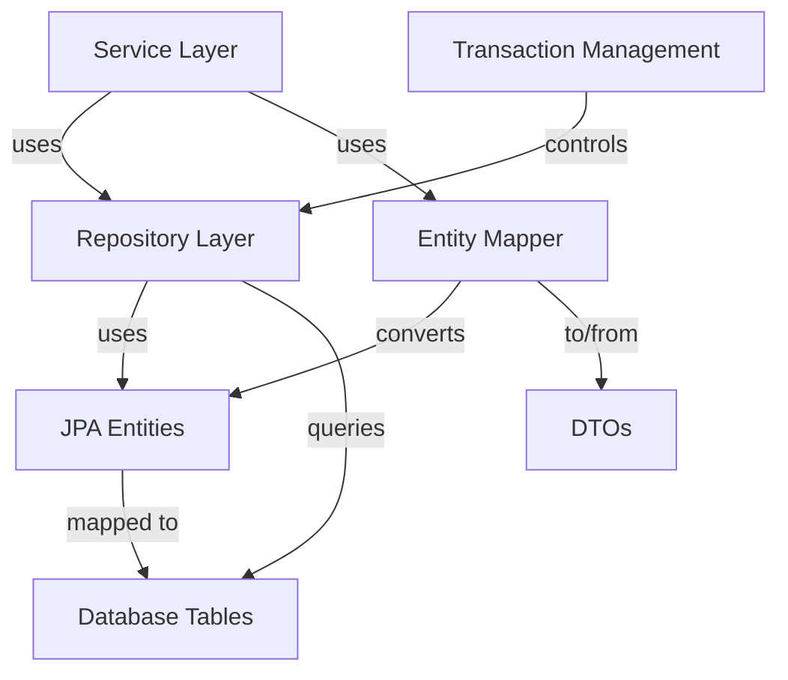
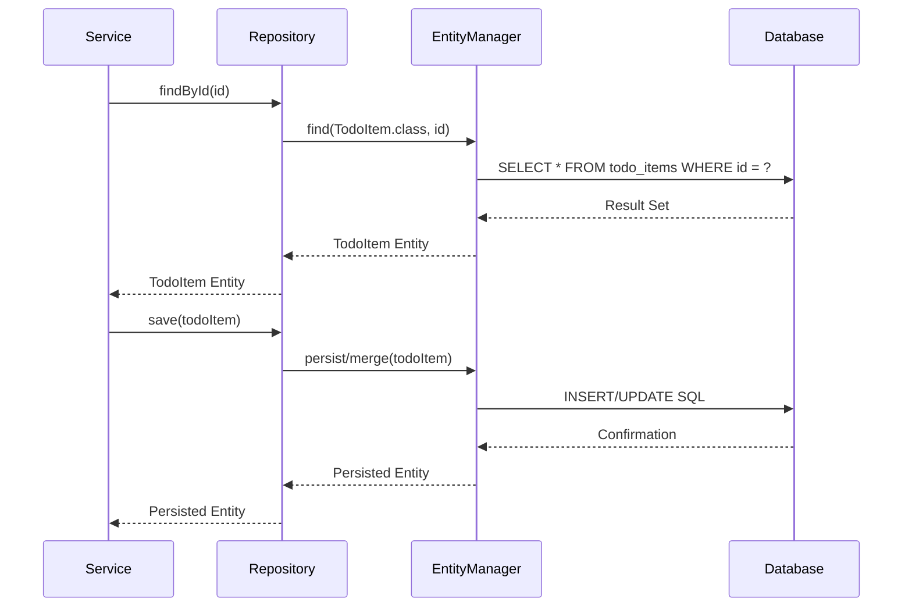

# Data Layer Design Suggestion

## Introduction

This document outlines the design for the data persistence layer of the TODO List application. The data layer is responsible for storing and retrieving TODO items using Spring Data JPA with an H2 embedded database. The design focuses on efficient data access, maintainability, and proper separation of concerns between the database and application logic.

## Justification

The proposed data layer design is justified by the following factors:

1. **Spring Data JPA**: Provides an abstraction over JPA, reducing boilerplate code and offering powerful query methods while maintaining the flexibility to write custom queries when needed.
2. **H2 Database**: Lightweight embedded database that's perfect for development and small to medium-sized applications. It's easy to set up, requires minimal configuration, and can be easily replaced with a more robust database in production if needed.
3. **Repository Pattern**: Encapsulates data access logic, making the application more maintainable and testable by providing a clean separation between business logic and data access.
4. **Entity-DTO Separation**: Keeps the internal data model separate from the API contracts, allowing independent evolution of the database schema and API.
5. **Auditing Fields**: Automatic tracking of creation and modification timestamps improves data traceability.

## Component Diagram



## Sequence Diagram



## Alternative Solutions

### NoSQL Database (MongoDB)

Using a NoSQL database like MongoDB could offer:

1. **Schema Flexibility**: NoSQL databases don't require a predefined schema, allowing for easy addition of new fields.
2. **Horizontal Scalability**: Better scaling characteristics for very large datasets.
3. **JSON-like Document Storage**: Natural fit for JavaScript-based applications.

However, a relational database (H2) was chosen because:

- The TODO application data has a clear relational structure
- ACID transactions are important for data integrity
- The application size doesn't require the scalability benefits of NoSQL
- The team may have more experience with SQL databases

### Native SQL with JDBC

Using JDBC directly without an ORM could provide:

1. **Performance**: Direct SQL can be more performant in certain scenarios.
2. **Control**: Complete control over SQL queries and database interactions.
3. **No Abstraction Leakage**: Avoids potential ORM abstraction issues.

However, Spring Data JPA was chosen because:

- Significant reduction in boilerplate code
- Automatic mapping between objects and database tables
- Built-in support for common operations and pagination
- The performance benefits of raw JDBC aren't necessary for this application's scale

## Considered and Discarded Solutions

### Active Record Pattern

The Active Record pattern, where entities contain their own data access methods, was considered but discarded because:
- It tightly couples the domain model with data access logic
- It makes testing more difficult
- It doesn't align well with Spring's dependency injection approach
- Repository pattern provides better separation of concerns

### Plain Hibernate Without Spring Data JPA

Using Hibernate directly without Spring Data JPA was considered but discarded because:
- Spring Data JPA reduces boilerplate code significantly
- Spring Data JPA's query methods are powerful and concise
- Integration with Spring's transaction management is smoother
- The additional abstraction layer doesn't have significant downsides for this application

### In-Memory Data Storage Without Database

A pure in-memory solution without persistence was considered but discarded because:
- Data would be lost when the application restarts
- It doesn't provide durability guarantees
- It doesn't support multiple application instances sharing data
- The overhead of setting up a lightweight database like H2 is minimal

## Implementation Details

### Entity Design

```java
@Entity
@Table(name = "todo_items")
@EntityListeners(AuditingEntityListener.class)
public class TodoItem {
    
    @Id
    @GeneratedValue(strategy = GenerationType.IDENTITY)
    private Long id;
    
    @Column(nullable = false)
    private String name;
    
    private String location;
    
    @Column(name = "due_date")
    private LocalDateTime dueDate;
    
    @Enumerated(EnumType.STRING)
    @Column(nullable = false)
    private TodoStatus status;
    
    @Column(columnDefinition = "TEXT")
    private String notes;
    
    @Column(name = "created_at", nullable = false, updatable = false)
    @CreationTimestamp
    private LocalDateTime createdAt;
    
    @Column(name = "updated_at", nullable = false)
    @UpdateTimestamp
    private LocalDateTime updatedAt;
    
    // Getters, setters, constructors
}
```

### Repository Interface

```java
@Repository
public interface TodoRepository extends JpaRepository<TodoItem, Long> {
    
    Page<TodoItem> findByStatus(TodoStatus status, Pageable pageable);
    
    @Query("SELECT t FROM TodoItem t WHERE DATE(t.dueDate) = CURRENT_DATE")
    List<TodoItem> findTodosDueToday();
    
    @Query("SELECT t FROM TodoItem t WHERE t.dueDate < CURRENT_TIMESTAMP AND t.status = 'PENDING'")
    List<TodoItem> findOverdueTodos();
}
```

### Database Configuration

```properties
# H2 Database Configuration
spring.datasource.url=jdbc:h2:file:./todoapp;DB_CLOSE_DELAY=-1;DB_CLOSE_ON_EXIT=FALSE
spring.datasource.driverClassName=org.h2.Driver
spring.datasource.username=sa
spring.datasource.password=password
spring.h2.console.enabled=true
spring.h2.console.path=/h2-console

# JPA Configuration
spring.jpa.database-platform=org.hibernate.dialect.H2Dialect
spring.jpa.hibernate.ddl-auto=update
spring.jpa.show-sql=true
spring.jpa.properties.hibernate.format_sql=true

# Connection Pooling
spring.datasource.hikari.maximum-pool-size=10
spring.datasource.hikari.minimum-idle=5
```

### Data Migration Strategy

```java
@Component
@Order(1)
public class DataInitializer implements CommandLineRunner {

    private final TodoRepository todoRepository;
    
    @Autowired
    public DataInitializer(TodoRepository todoRepository) {
        this.todoRepository = todoRepository;
    }
    
    @Override
    public void run(String... args) {
        // Check if database is empty
        if (todoRepository.count() == 0) {
            // Add some sample data
            TodoItem item1 = new TodoItem();
            item1.setName("Setup development environment");
            item1.setLocation("Home office");
            item1.setDueDate(LocalDateTime.now().plusDays(1));
            item1.setStatus(TodoStatus.PENDING);
            item1.setNotes("Install all required tools and dependencies");
            
            todoRepository.save(item1);
            
            // Add more sample items...
        }
    }
}
```

### Entity to DTO Mapping

```java
@Component
public class TodoItemMapper {

    public TodoItemDTO toDto(TodoItem entity) {
        TodoItemDTO dto = new TodoItemDTO();
        dto.setId(entity.getId());
        dto.setName(entity.getName());
        dto.setLocation(entity.getLocation());
        dto.setDueDate(entity.getDueDate());
        dto.setStatus(entity.getStatus());
        dto.setNotes(entity.getNotes());
        return dto;
    }
    
    public TodoItem toEntity(TodoItemDTO dto) {
        TodoItem entity = new TodoItem();
        entity.setId(dto.getId());
        entity.setName(dto.getName());
        entity.setLocation(dto.getLocation());
        entity.setDueDate(dto.getDueDate());
        entity.setStatus(dto.getStatus());
        entity.setNotes(dto.getNotes());
        return entity;
    }
}
```