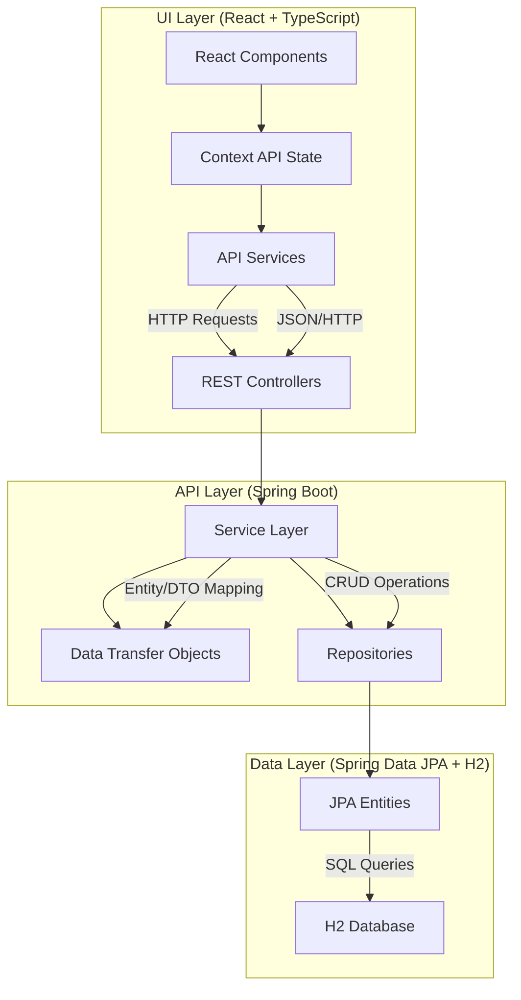
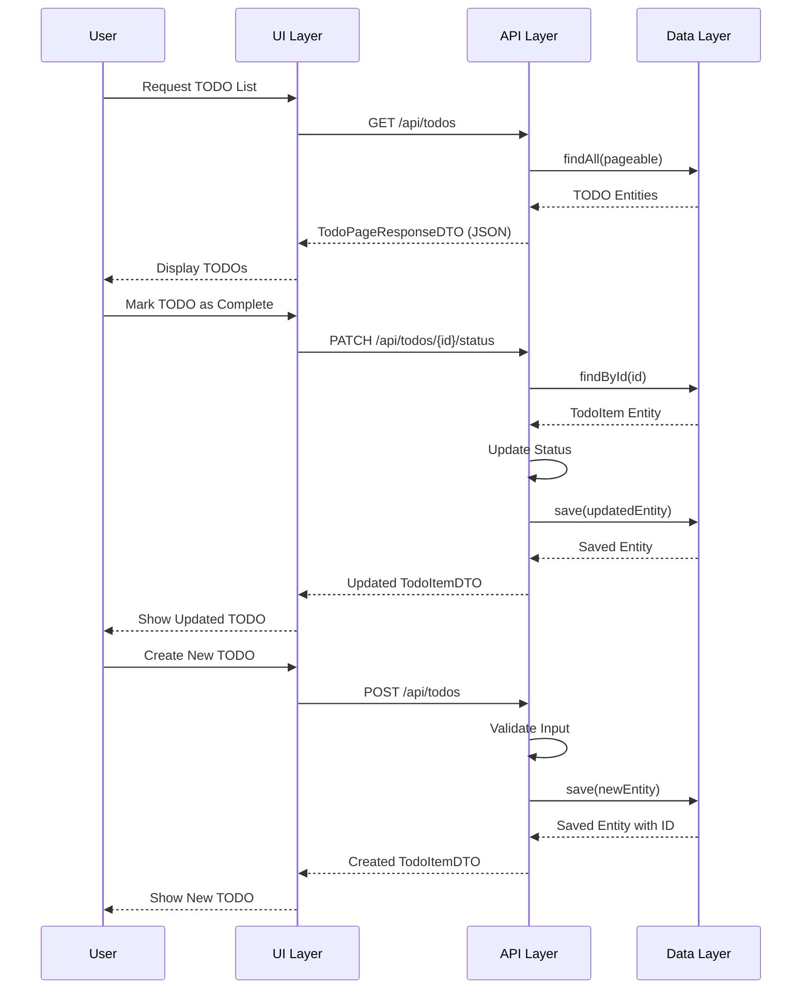

# Overall Design for TODO List Application

## Introduction

This document provides a comprehensive overview of the TODO List application design, explaining how the UI, API, and data layers interact to create a cohesive system. The application follows a three-tier architecture pattern with clear separation of concerns between presentation, business logic, and data access layers.

## System Architecture

The TODO List application consists of three main components:

1. **UI Layer**: A React-based SPA with TypeScript and TSX, providing an interactive user interface
2. **API Layer**: A Spring Boot REST API serving as a Backend-For-Frontend (BFF)
3. **Data Layer**: A data persistence layer using Spring Data JPA with an H2 database

## Component Diagram



## Sequence Diagram for Core Operations

The following sequence diagram illustrates how the three layers interact during key operations like viewing and updating TODO items:



## Layer Interaction Details

### UI to API Communication

1. **Request Flow**:
   - UI components trigger API calls through service modules
   - Axios (or similar HTTP client) sends requests to the API endpoints
   - Requests include appropriate headers (Content-Type, Authorization if needed)
   - TypeScript ensures type safety for request and response data

2. **Response Handling**:
   - API responses are mapped to TypeScript interfaces
   - UI updates state based on API responses
   - Error handling provides user-friendly error messages

### API to Data Layer Communication

1. **Service Layer Logic**:
   - Controllers delegate business logic to service classes
   - Services use repositories to access data
   - DTOs are mapped to entities before persistence
   - Entities are mapped to DTOs before returning to controllers

2. **Transaction Management**:
   - Spring's `@Transactional` annotations ensure data consistency
   - Services define transaction boundaries
   - Repositories handle actual database operations

## Validation and Security Enhancements

### Input Validation

1. **UI Layer Validation**:
   ```tsx
   // Form validation with Formik and Yup
   const validationSchema = Yup.object({
     name: Yup.string().required('Name is required'),
     dueDate: Yup.date().min(
       new Date(Date.now() - 86400000),
       'Due date cannot be in the past'
     ),
     location: Yup.string(),
     notes: Yup.string().max(500, 'Notes cannot exceed 500 characters')
   });
   ```

2. **API Layer Validation**:
   ```java
   public class TodoItemDTO {
       @NotBlank(message = "Name is required")
       private String name;
       
       private String location;
       
       @Future(message = "Due date must be in the future")
       private LocalDateTime dueDate;
       
       @NotNull(message = "Status is required")
       private TodoStatus status;
       
       @Size(max = 500, message = "Notes cannot exceed 500 characters")
       private String notes;
   }
   ```

3. **Database Constraints**:
   ```java
   @Column(nullable = false)
   private String name;
   
   @Column(columnDefinition = "TEXT", length = 500)
   private String notes;
   ```

### Security Enhancements

1. **API Security**:
   - CSRF protection for non-GET requests
   - Rate limiting to prevent abuse
   - Input sanitization to prevent injection attacks
   - Proper error handling to avoid information leakage

   ```java
   @Configuration
   @EnableWebSecurity
   public class WebSecurityConfig extends WebSecurityConfigurerAdapter {
       
       @Override
       protected void configure(HttpSecurity http) throws Exception {
           http
               .csrf().csrfTokenRepository(CookieCsrfTokenRepository.withHttpOnlyFalse())
               .and()
               .headers().frameOptions().deny()
               .and()
               .contentSecurityPolicy("default-src 'self'");
       }
   }
   ```

2. **UI Security**:
   - Encoding user-generated content to prevent XSS
   - Using HTTPS for all communications
   - Implementing Content Security Policy
   - Input validation before sending to API

   ```tsx
   // Preventing XSS with DOMPurify
   import DOMPurify from 'dompurify';
   
   const sanitizedNotes = DOMPurify.sanitize(todo.notes);
   ```

3. **Database Security**:
   - Parameterized queries (handled by JPA)
   - Least privilege principle for database user
   - Connection encryption
   - Auditing of data changes

   ```properties
   # Database Security Configuration
   spring.datasource.username=todoapp_user
   spring.datasource.password=${DB_PASSWORD}
   spring.jpa.properties.hibernate.connection.provider_disables_autocommit=true
   ```

## Future Enhancements

1. **Authentication and User Management**:
   - Implement Spring Security with JWT authentication
   - Add user management to allow multiple users with their own TODO lists
   - Role-based access control for shared TODOs

2. **Advanced Features**:
   - TODO categories/labels
   - Recurring TODOs
   - Notifications and reminders
   - Sharing and collaboration features

3. **Technical Improvements**:
   - Migration to a production-grade database like PostgreSQL
   - Containerization with Docker for easier deployment
   - CI/CD pipeline for automated testing and deployment
   - Monitoring and performance optimization

## Conclusion

The TODO List application follows a clean, maintainable architecture with clear separation of concerns between UI, API, and data layers. The TypeScript-based React frontend communicates with the Spring Boot API, which in turn interacts with the H2 database through Spring Data JPA. This design ensures scalability, maintainability, and provides a solid foundation for future enhancements.