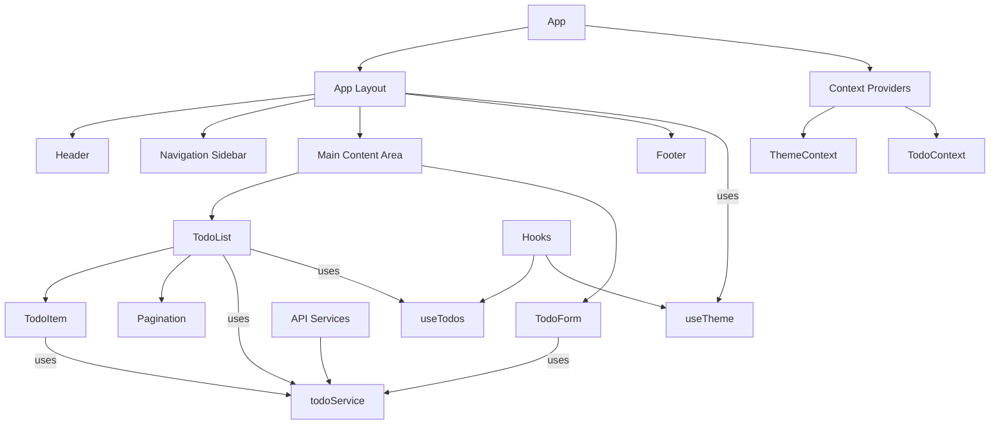
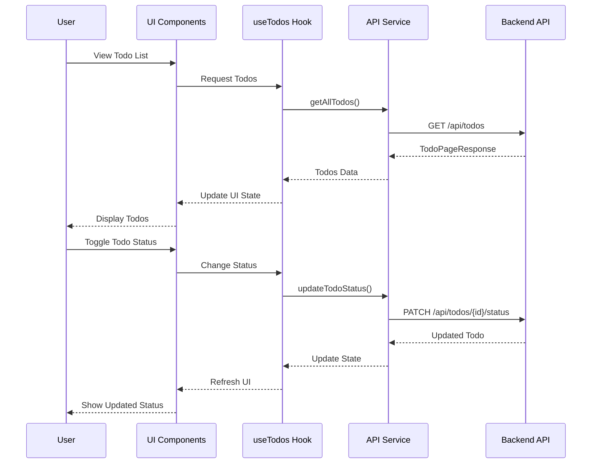

# UI Application Design Suggestion

## Introduction

This document outlines the design for the User Interface component of the TODO List application. The UI is a React-based Single Page Application (SPA) built with TypeScript and TSX, focusing on responsive design, accessibility, and an intuitive user experience. The design incorporates a modern component-based architecture with clear separation of concerns and maintainable code structure.

## Justification

The proposed UI design is justified by the following factors:

1. **React with TypeScript**: React provides a robust component-based architecture, while TypeScript adds static type checking, enhancing code quality and developer experience.
2. **Chakra UI Component Library**: Provides accessible, responsive components out of the box with strong TypeScript support and theming capabilities.
3. **Context API for State Management**: For a small to medium-sized application, React's built-in Context API provides sufficient state management without the overhead of additional libraries.
4. **Responsive Layout**: The design adapts to different screen sizes, making the application accessible across devices.
5. **Accessibility Focus**: Incorporating WCAG standards ensures the application is usable by people with various abilities and disabilities.

## Component Diagram



## Sequence Diagram



## Alternative Solutions

### Redux for State Management

Using Redux for state management could offer:

1. **Centralized Store**: Single source of truth for the application state.
2. **Time-Travel Debugging**: Ability to inspect state changes over time.
3. **Middleware Support**: Built-in support for side effects and async operations.

However, React Context API was chosen because:

- The application's state management needs are relatively simple
- The learning curve for Redux is steeper than Context API
- Redux introduces additional complexity and boilerplate code
- For this application size, Context API provides similar benefits with less overhead

### Material-UI Component Library

Material-UI was considered as an alternative to Chakra UI:

1. **Google's Design System**: Follows Google's widely-recognized Material Design principles.
2. **Mature Ecosystem**: Large community and extensive documentation.
3. **Rich Component Set**: Comprehensive set of pre-built components.

However, Chakra UI was chosen because:

- Better accessibility support out-of-the-box
- More flexible theming system that's easier to customize
- Less opinionated design that can adapt to different visual styles
- More modern API based on styled-system principles

## Considered and Discarded Solutions

### Class-Based React Components

Using class-based React components instead of functional components was considered but discarded because:
- Functional components with hooks are more concise and readable
- Hooks enable better code reuse across components
- The React team recommends functional components for new code
- TypeScript works well with functional components and hooks

### CSS Modules or Styled Components

Using CSS Modules or Styled Components for styling was considered but discarded because:
- Chakra UI provides a comprehensive styling system that covers most needs
- Mixing styling approaches could lead to inconsistencies
- Using a component library reduces the need for custom styling
- The utility-first approach of Chakra UI makes styling more maintainable

### Server-Side Rendering (Next.js)

Implementing the application with Next.js for server-side rendering was considered but discarded because:
- The TODO application is primarily interactive and client-focused
- SEO concerns are minimal for a personal or internal tool
- Client-side rendering provides a simpler development experience
- The application doesn't require the advanced routing features of Next.js

## Implementation Details

### TodoItem Component Example

```tsx
// src/components/features/todos/TodoItem.tsx
import React from 'react';
import { Box, Checkbox, Flex, Text, Badge, useColorModeValue } from '@chakra-ui/react';
import { format } from 'date-fns';
import { TodoItem as TodoItemType, TodoStatus } from '../../../types/todo';

interface TodoItemProps {
  todo: TodoItemType;
  onStatusChange: (id: number, status: TodoStatus) => void;
}

export const TodoItem: React.FC<TodoItemProps> = ({ todo, onStatusChange }) => {
  const { id, name, location, dueDate, status, notes } = todo;
  const isCompleted = status === TodoStatus.COMPLETED;
  
  const textColor = useColorModeValue('gray.800', 'white');
  const bgColor = useColorModeValue('white', 'gray.700');
  
  const handleStatusChange = (e: React.ChangeEvent<HTMLInputElement>) => {
    if (!id) return;
    onStatusChange(
      id, 
      e.target.checked ? TodoStatus.COMPLETED : TodoStatus.PENDING
    );
  };
  
  return (
    <Box 
      p={4} 
      borderWidth="1px" 
      borderRadius="lg" 
      bg={bgColor}
      mb={2}
      transition="all 0.2s"
      _hover={{ boxShadow: 'md' }}
    >
      <Flex justifyContent="space-between" alignItems="center">
        <Flex direction="column" flex="1" mr={4}>
          <Text 
            fontSize="lg" 
            fontWeight="semibold"
            color={textColor}
            textDecoration={isCompleted ? 'line-through' : 'none'}
          >
            {name}
          </Text>
          
          {location && (
            <Text fontSize="sm" color="gray.500" mt={1}>
              Location: {location}
            </Text>
          )}
          
          {dueDate && (
            <Text fontSize="sm" color="gray.500" mt={1}>
              Due: {format(new Date(dueDate), 'PPp')}
            </Text>
          )}
          
          {notes && (
            <Text fontSize="sm" color="gray.500" mt={1} noOfLines={1}>
              {notes}
            </Text>
          )}
        </Flex>
        
        <Checkbox 
          size="lg" 
          isChecked={isCompleted} 
          onChange={handleStatusChange}
          aria-label={isCompleted ? "Mark as incomplete" : "Mark as complete"}
        />
      </Flex>
    </Box>
  );
};
```

### TodoContext Example

```tsx
// src/context/TodoContext.tsx
import React, { createContext, useContext, useState, useCallback, ReactNode } from 'react';
import { TodoItem, TodoStatus, TodoPageResponse } from '../types/todo';
import { todoService } from '../services/todoService';

interface TodoContextType {
  todos: TodoItem[];
  loading: boolean;
  error: Error | null;
  totalElements: number;
  totalPages: number;
  currentPage: number;
  setPage: (page: number) => void;
  setStatus: (status: TodoStatus | null) => void;
  refetch: () => Promise<void>;
  updateTodoStatus: (id: number, status: TodoStatus) => Promise<void>;
  deleteTodo: (id: number) => Promise<void>;
  createTodo: (todo: Omit<TodoItem, 'id'>) => Promise<void>;
}

const TodoContext = createContext<TodoContextType | undefined>(undefined);

export const TodoProvider: React.FC<{ children: ReactNode }> = ({ children }) => {
  const [todos, setTodos] = useState<TodoItem[]>([]);
  const [loading, setLoading] = useState<boolean>(true);
  const [error, setError] = useState<Error | null>(null);
  const [totalElements, setTotalElements] = useState<number>(0);
  const [totalPages, setTotalPages] = useState<number>(0);
  const [currentPage, setCurrentPage] = useState<number>(0);
  const [status, setStatus] = useState<TodoStatus | null>(null);

  const fetchTodos = useCallback(async () => {
    setLoading(true);
    try {
      const response: TodoPageResponse = await todoService.getAllTodos(
        currentPage,
        10,
        'dueDate',
        'ASC',
        status
      );
      
      setTodos(response.content);
      setTotalElements(response.totalElements);
      setTotalPages(response.totalPages);
      setError(null);
    } catch (err) {
      setError(err instanceof Error ? err : new Error('An unknown error occurred'));
    } finally {
      setLoading(false);
    }
  }, [currentPage, status]);

  useEffect(() => {
    fetchTodos();
  }, [fetchTodos]);

  const updateTodoStatus = async (id: number, newStatus: TodoStatus): Promise<void> => {
    try {
      await todoService.updateTodoStatus(id, newStatus);
      await fetchTodos();
    } catch (err) {
      setError(err instanceof Error ? err : new Error('Failed to update todo status'));
    }
  };

  const deleteTodo = async (id: number): Promise<void> => {
    try {
      await todoService.deleteTodo(id);
      await fetchTodos();
    } catch (err) {
      setError(err instanceof Error ? err : new Error('Failed to delete todo'));
    }
  };

  const createTodo = async (todo: Omit<TodoItem, 'id'>): Promise<void> => {
    try {
      await todoService.createTodo(todo);
      await fetchTodos();
    } catch (err) {
      setError(err instanceof Error ? err : new Error('Failed to create todo'));
    }
  };

  return (
    <TodoContext.Provider
      value={{
        todos,
        loading,
        error,
        totalElements,
        totalPages,
        currentPage,
        setPage: setCurrentPage,
        setStatus,
        refetch: fetchTodos,
        updateTodoStatus,
        deleteTodo,
        createTodo
      }}
    >
      {children}
    </TodoContext.Provider>
  );
};

export const useTodoContext = (): TodoContextType => {
  const context = useContext(TodoContext);
  if (context === undefined) {
    throw new Error('useTodoContext must be used within a TodoProvider');
  }
  return context;
};
```

### Accessibility Features Implementation

```tsx
// src/context/ThemeContext.tsx
import React, { createContext, useContext, useState, useCallback, useEffect, ReactNode } from 'react';
import { ChakraProvider, extendTheme, ThemeConfig } from '@chakra-ui/react';

interface ThemeContextType {
  colorMode: 'light' | 'dark';
  toggleColorMode: () => void;
  fontSize: 'sm' | 'md' | 'lg' | 'xl';
  setFontSize: (size: 'sm' | 'md' | 'lg' | 'xl') => void;
  reducedMotion: boolean;
  toggleReducedMotion: () => void;
}

const ThemeContext = createContext<ThemeContextType | undefined>(undefined);

export const ThemeProvider: React.FC<{ children: ReactNode }> = ({ children }) => {
  const [colorMode, setColorMode] = useState<'light' | 'dark'>('light');
  const [fontSize, setFontSize] = useState<'sm' | 'md' | 'lg' | 'xl'>('md');
  const [reducedMotion, setReducedMotion] = useState<boolean>(false);

  // Check user preferences
  useEffect(() => {
    // Check for saved preferences or system preferences
    const savedColorMode = localStorage.getItem('colorMode') as 'light' | 'dark' | null;
    const savedFontSize = localStorage.getItem('fontSize') as 'sm' | 'md' | 'lg' | 'xl' | null;
    const prefersReducedMotion = window.matchMedia('(prefers-reduced-motion: reduce)').matches;
    
    if (savedColorMode) {
      setColorMode(savedColorMode);
    } else if (window.matchMedia('(prefers-color-scheme: dark)').matches) {
      setColorMode('dark');
    }
    
    if (savedFontSize) {
      setFontSize(savedFontSize);
    }
    
    setReducedMotion(prefersReducedMotion);
  }, []);

  const toggleColorMode = useCallback(() => {
    const newMode = colorMode === 'light' ? 'dark' : 'light';
    setColorMode(newMode);
    localStorage.setItem('colorMode', newMode);
  }, [colorMode]);
  
  const changeFontSize = useCallback((size: 'sm' | 'md' | 'lg' | 'xl') => {
    setFontSize(size);
    localStorage.setItem('fontSize', size);
  }, []);
  
  const toggleReducedMotion = useCallback(() => {
    setReducedMotion(!reducedMotion);
  }, [reducedMotion]);
  
  // Create theme based on preferences
  const theme = extendTheme({
    config: {
      initialColorMode: colorMode,
      useSystemColorMode: false,
    } as ThemeConfig,
    fonts: {
      body: 'system-ui, sans-serif',
      heading: 'system-ui, sans-serif',
    },
    fontSizes: {
      // Adjust base font sizes based on user preference
      base: fontSize === 'sm' ? '14px' : 
            fontSize === 'md' ? '16px' : 
            fontSize === 'lg' ? '18px' : '20px',
    },
    styles: {
      global: (props: any) => ({
        body: {
          transition: reducedMotion ? 'none' : 'background-color 0.2s',
        },
      }),
    },
  });

  return (
    <ThemeContext.Provider
      value={{
        colorMode,
        toggleColorMode,
        fontSize,
        setFontSize: changeFontSize,
        reducedMotion,
        toggleReducedMotion,
      }}
    >
      <ChakraProvider theme={theme}>{children}</ChakraProvider>
    </ThemeContext.Provider>
  );
};

export const useTheme = (): ThemeContextType => {
  const context = useContext(ThemeContext);
  if (context === undefined) {
    throw new Error('useTheme must be used within a ThemeProvider');
  }
  return context;
};
```